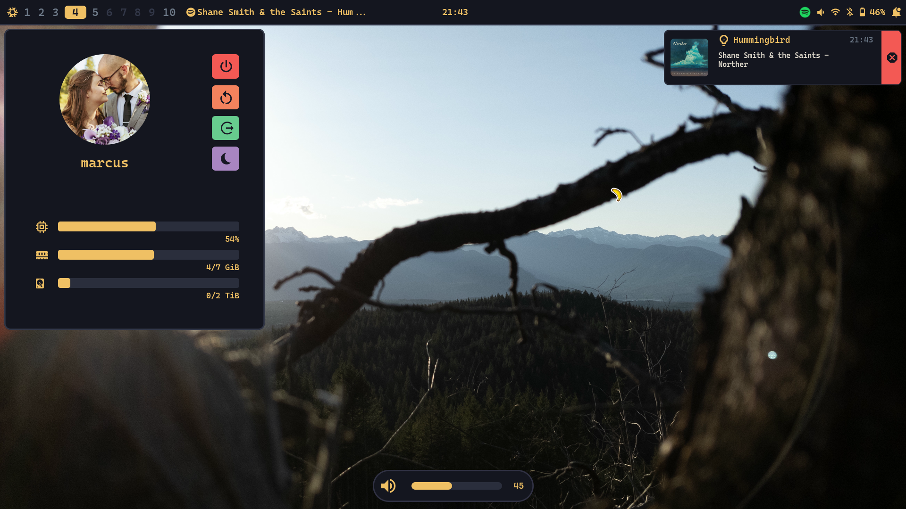

<h1 align="center">dotfiles</h1>

_<p align="center">Keep It Simple Stupid</p>_



 

### NixOS

Each system added to the flake has a corresponding directory in
[nixos/](./nixos/) that contains the main configuration file as well as the
hardware configuration. The directory is titled the hostname of its system. The
hostname and primary username are passed to the configuration through the
**hostName** and **defaultUser** in **specialArgs**.

NixOS modules are located in [nixos/modules/](./nixos/modules/). They are sorted
between base, desktop, server, and users. Options are assigned to these
directories if they are meant to be used across multiple configurations. Modules
are separated into files if they are opt-in or they have different custom
options to choose from for each configuration.

### Home Manager

Home Manager is installed as a NixOS module (see
[users/default.nix](./nixos/modules/users/default.nix)) and as standalone
configurations in the flake. Each configuration name added to the **homes** list
in the flake has a file located in [home-manager/](./home-manager/). The
filename is the user followed by the hostname (ie. user-host.nix). Inside the
flake, the **hostName** is passed through **extraSpecialArgs** to the
configurations. The username needs to be set by **home.username**.

Home manager modules are located in
[home-manager/modules/](./home-manager/modules/). They are sorted between base,
desktop, and server. Similar to the NixOS modules, options are assigned to these
directories if they are meant to be used across multiple configurations. Modules
are also separated into files if they are opt-in or they have different custom
options to choose from for each configuration.

### Users

I can add more users to a system via the default **users.users** options. If the
user will also include a Home Manager setup, that needs to be added to the
**homes** list in the flake. The corresponding configuration file must also be
correctly named (user-host.nix) and placed in [home-manager/](.home-manager/).

### gLib

This contains two helper functions: **scanPaths** and **scanFIles**.

**scanPaths** is used to import all nix files _(excluding default.nix)_ in a
directory.

```nix
{ inputs, gLib, ...} {
    imports = gLib.scanPaths ./.;

    # you can also append additional imports, ie modules from other flakes
    imports = (gLib.scanPaths ./.) ++ [inputs.bigChungus.nixosModules.carrots];
}
```

**scanFiles** is used to generate a list of all files in a directory. The only
spot I use this currently is as a helper for generating
**openssh.authorizedKeys**.

```nix
# nixos/modules/users/default.nix

{ gLib,... }: let
    keyScan = gLib.scanFiles ./keys;
in {
    ...
    openssh.authorizedKeys.keys = map (builtins.readFile) keyScan;
    ...
```

### TODO

- setup devenv
- find a more centralized solution for installed packages (system and user)
- finalize Hyprpanel settings/theme and add to HM module
- adjust nushell nx helper more to my liking (maybe create a lil go cli
  instead?)

## Adding a new system

Use nix-shell with git in order to clone this repo. Then enter the directory and
use [shell.nix](./shell.nix) provided for the rest of the process.

```sh
nix-shell -p git --command "git clone https://github.com/grapeofwrath/dotfiles.git"
cd dotfiles
nix-shell
```

Ensure that **~/.config/sops/age/keys.txt** exists on target system and that it
matches that file on existing hosts.

```sh
mkdir -p ~/.config/sops/age
age-keygen -o ~/.config/sops/age/keys.txt
```

Create an access key specific to the system using its public ssh key. Add it to
the hosts section in [.sops.yaml](./.sops.yaml). Update
[secrets.yaml](./secrets.yaml) with sops.

```sh
cat /etc/ssh/ssh_host_ed25519_key.pub | ssh-to-age
vim .sops.yaml
sops updatekeys secrets.yaml
```

Generate an ssh key for the user and add it to [secrets.yaml](./secrets.yaml),
removing the file afterwards. Move the public key to
[nixos/modules/users/keys/](./nixos/modules/users/keys/) and don't forget to
upload it to github. Add any NixOS/Home-Manager files to [nixos/](./nixos/) and
[home-manager/](./home-manager/) and add the new hostName to the **systems**
list in the flake. Rebuild the system with the new configuration.

```sh
ssh-keygen -t ed25519 -f id_<user>-<host> -C <user>@<host>
cat id_<user>-<host>
sops secrets.yaml
rm id_<user>-<host>
mv id_<user>-<host>.pub nixos/modules/users/keys/
```
